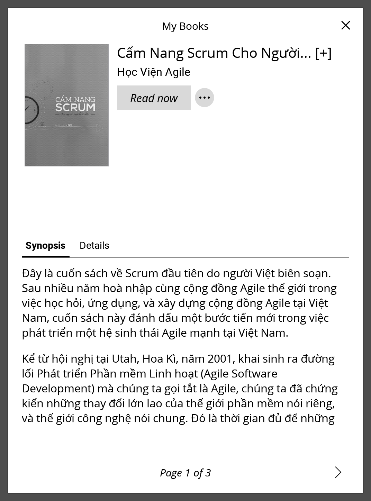
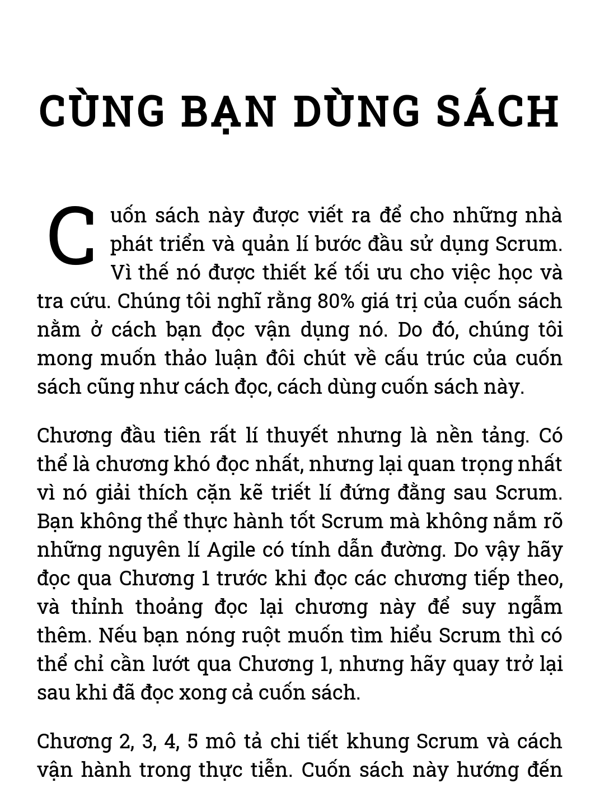
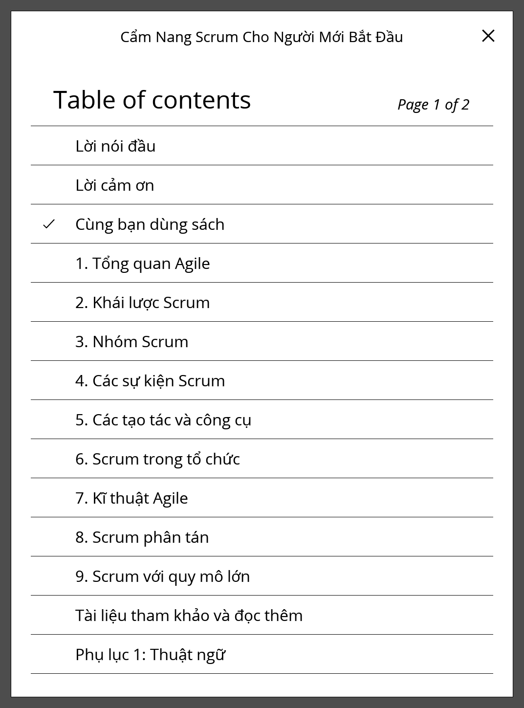
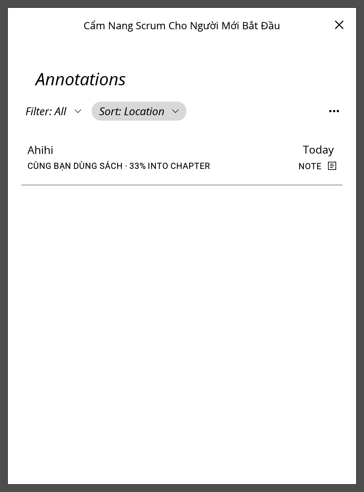
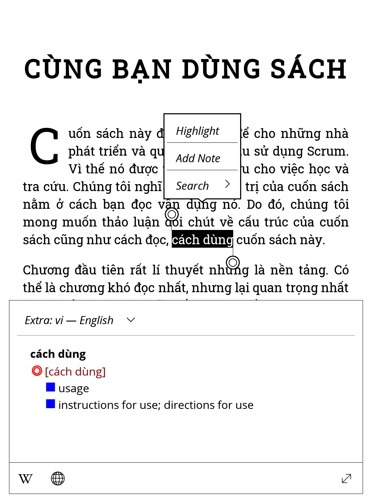

# Sửa lỗi font Tiếng Việt cho máy đọc sách Kobo

Sách Tiếng Việt trên Kobo vẫn có thể đọc được khi chọn font `Kobo Nickel`, tuy nhiên tên sách, mục lục, ... sẽ bị lỗi do font hệ thống không hỗ trợ. Cách sửa lỗi này là ghi đè font `Avenir Next` và `Georgia` bằng font có hỗ trợ Tiếng Việt.

## Thay thế font hệ thống

1. Kết nối Kobo với máy tính.
2. Tải **KoboRoot.tgz** [tại đây](https://github.com/lelinhtinh/kobo-tieng-viet/releases/latest) và chép vào thư mục **.kobo**.
3. Thực hiện **eject ổ USB** để ngắt kết nối Kobo an toàn, tránh lỗi dữ liệu. Chờ một lúc để máy khởi động lại.

## Cài từ điển Anh-Việt

1. Tải **DictUtil** bản mới nhất [tại đây](https://github.com/pgaskin/dictutil/releases/latest), tùy theo hệ điều hành, nếu dùng Windows thì chọn **dictutil-windows.exe**.
2. Tải **dicthtml-en-vi.zip** và **dicthtml-vi-en.zip** [tại đây](https://github.com/lelinhtinh/kobo-tieng-viet/releases/tag/v0.4.0), lưu vào cùng thư mục vừa tải DictUtil.
3. Kết nối Kobo với máy tính. Tại thư mục chứa từ điển và DictUtil, chạy lệnh:

    ```bash
    chmod +x dictutil-linux-64bit
    ./dictutil-linux-64bit install dicthtml-en-vi.zip
    ./dictutil-linux-64bit install dicthtml-vi-en.zip
    ```

    hoặc:

    ```bash
    ./dictutil-windows.exe install dicthtml-en-vi.zip
    ./dictutil-windows.exe install dicthtml-vi-en.zip
    ```

    ... nếu dùng Windows.
4. Thực hiện **eject ổ USB** để ngắt kết nối Kobo.

## Ảnh chụp màn hình

|Giới thiệu|Trang đọc|Mục lục|Ghi chú|Tra từ điển|
|:-:|:-:|:-:|:-:|:-:|
|[](./screenshot/screen_001.png)|[](./screenshot/screen_002.png)|[](./screenshot/screen_003.png)|[](./screenshot/screen_004.png)|[](./screenshot/screen_005.png)|

## Công cụ & nguồn tham khảo

- [Google Fonts](https://fonts.google.com/?category=Serif,Sans+Serif&subset=vietnamese&stylecount=4): Tìm font hỗ trợ Tiếng Việt.
- [FontForge](http://fontforge.github.io/): Công cụ đổi thông tin font sang `Avenir Next` và `Georgia`.
- [LacVietExtract](https://github.com/Meigyoku-Thmn/LacVietExtract/releases/latest): Nguồn từ điển.
- [Penelope](https://github.com/pettarin/penelope) và [DictUtil](https://github.com/pgaskin/dictutil): Công cụ chuyển đổi từ điển sang định dạng **dicthtml**.
- [Installing custom dictionaries](https://pgaskin.net/dictutil/dicthtml/install.html): Các bước cài từ điển thủ công nếu không thích dùng DictUtil.

## [Wiki](https://github.com/lelinhtinh/kobo-tieng-viet/wiki) bổ sung

- [Cách tạo font Tiếng Việt](https://github.com/lelinhtinh/kobo-tieng-viet/wiki/C%C3%A1ch-t%E1%BA%A1o-font-Ti%E1%BA%BFng-Vi%E1%BB%87t-cho-Kobo)
- [Convert từ điển StarDict sang DictZip](https://github.com/lelinhtinh/kobo-tieng-viet/wiki/T%E1%BB%B1-t%E1%BA%A1o-t%E1%BB%AB-%C4%91i%E1%BB%83n-cho-Kobo)
- [Các giải pháp khác để hiển thị Tiếng Việt](https://github.com/lelinhtinh/kobo-tieng-viet/wiki/C%C3%A1c-gi%E1%BA%A3i-ph%C3%A1p-kh%C3%A1c-%C4%91%E1%BB%83-hi%E1%BB%83n-th%E1%BB%8B-Ti%E1%BA%BFng-Vi%E1%BB%87t-tr%C3%AAn-Kobo)
- [Một số thủ thuật đơn giản](https://github.com/lelinhtinh/kobo-tieng-viet/wiki/M%E1%BB%99t-s%E1%BB%91-th%E1%BB%A7-thu%E1%BA%ADt-%C4%91%C6%A1n-gi%E1%BA%A3n-cho-Kobo)
- [Cách downgrade về phiên bản cũ](https://github.com/lelinhtinh/kobo-tieng-viet/wiki/H%C6%B0%E1%BB%9Bng-d%E1%BA%ABn-h%E1%BA%A1-c%E1%BA%A5p-Kobo-v%E1%BB%81-phi%C3%AAn-b%E1%BA%A3n-c%C5%A9-h%C6%A1n)
